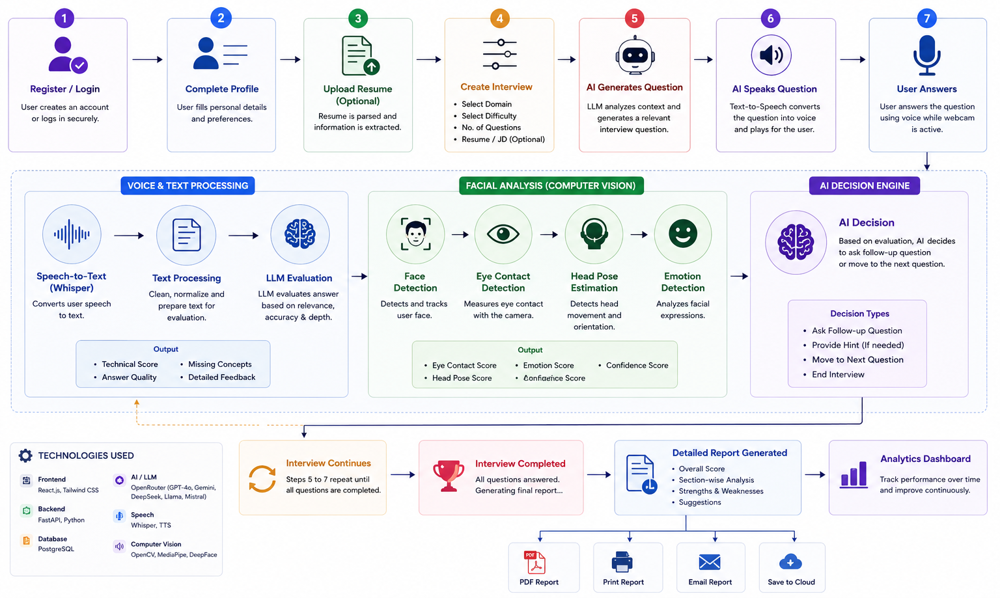

# 🎯 InterviewIQ – AI-Powered Interview Performance Analyzer
<div align="center">


### 🚀 AI-Powered Multimodal Mock Interview Platform using LLMs, Speech AI & Computer Vision

*Prepare smarter. Practice better. Get hired faster.*

</div>

---

# 📖 Overview

**InterviewIQ** is an AI-powered interview preparation platform that simulates real interview experiences and provides intelligent feedback to help candidates improve their interview performance.

Unlike traditional mock interview platforms, InterviewIQ not only asks interview questions but also analyzes every answer, evaluates communication quality, identifies strengths and weaknesses, generates follow-up questions, and provides personalized suggestions using Large Language Models (LLMs).

TThe platform supports Resume-Based, Job Description-Based, Technical, and HR interviews while analyzing technical knowledge, communication skills, confidence, facial expressions, eye contact, and overall interview performance using LLMs, Speech AI, and Computer Vision.

allowing users to practice for specific roles with customized interview sessions.

---
# ✨ Features

| Category | Features |
|----------|----------|
| 👤 User | Authentication, User Profile, Dashboard, Interview History, Resume Upload, PDF Reports |
| 🤖 AI Interview | AI Interviewer, Dynamic Question Generation, Context-Aware Questions, AI Follow-up Questions |
| 🎤 Voice AI | AI Voice Questions (Text-to-Speech), Voice Answer Recording, Speech-to-Text (Whisper), Text Answer Support |
| 😊 Computer Vision | Face Detection, Eye Contact Detection, Head Pose Analysis, Facial Expression Analysis, Attention Monitoring, Confidence Score |
| 📝 AI Evaluation | Answer Evaluation, Technical Score, Communication Score, Confidence Analysis, Question-wise Analysis |
| 💡 AI Assistance | AI Feedback, Improvement Suggestions, Personalized Learning Roadmap, Interview Summary |
| 📄 Interview Types | Resume-Based Interview, Job Description-Based Interview, Technical Interview, HR Interview, Custom Interview |
| 📊 Analytics & Reports | Performance Dashboard, Progress Tracking, Interview Reports, Performance Trends, Weak Topic Analysis, PDF Export |
| 👨‍💼 Admin | User Management, Interview Management, Analytics Dashboard, AI Usage Monitoring, Report Management |

# 🏗 System Architecture

```text
                    +---------------------------+
                    |   React + Vite Frontend   |
                    +------------+--------------+
                                 |
                       REST APIs / WebSocket
                                 |
                    +------------v--------------+
                    |       FastAPI Backend     |
                    +------------+--------------+
                                 |
      +--------------+-----------+-----------+--------------+
      |              |                       |              |
      |              |                       |              |
+-----v-----+  +-----v------+        +-------v------+ +-----v------+
| PostgreSQL|  | OpenRouter |        | Speech AI    | | Computer   |
| Database  |  | (LLMs)     |        | Whisper/TTS  | | Vision     |
+-----------+  +------------+        +--------------+ +------------+
                     |                                        |
         +-----------+-----------+                +-----------+-----------+
         |                       |                |                       |
     +---v----+             +----v----+      +----v-----+          +------v------+
     | Gemini |             | DeepSeek|      | OpenCV   |          | MediaPipe   |
     +--------+             +---------+      +----------+          +-------------+
                                   |
                              +----v----+
                              | Llama   |
                              +---------+
```
---

# 🛠 Tech Stack

| Category | Technologies |
|----------|--------------|
| Frontend | React.js, Vite, Tailwind CSS |
| Backend | FastAPI, Python, SQLAlchemy, Pydantic |
| Database | PostgreSQL |
| Authentication | JWT, OAuth |
| AI/LLM | OpenRouter, Gemini, DeepSeek, Llama, Prompt Engineering |
| Speech | Speech-to-Text APIs,Faster Whisper, Edge TTS |
| File Processing | PDF Parser, Resume Parser |
| Deployment | Docker, Render, Vercel, GitHub Actions |
| Version Control | Git & GitHub |

---
# ⚙️ Workflow 

<p align="center">

</p>

---
## ⚙️ Installation

### Clone Repository

```bash
git clone https://github.com/yourusername/InterviewIQ.git
cd InterviewIQ
Backend Setup
cd backend

python -m venv venv

# Windows
venv\Scripts\activate

# Linux/macOS
source venv/bin/activate

pip install -r requirements.txt

uvicorn app.main:app --reload
Frontend Setup
cd frontend

npm install

npm run dev
```
# 📂 Project Structure

```text
InterviewIQ/

├── frontend/
├── backend/
│   ├── api/
│   ├── ai/
│   ├── speech/
│   ├── vision/
│   ├── reports/
│   └── models/
│
├── assets/
├── uploads/
├── reports/
└── README.md
```

# 📋 Future Scope

- AI Voice Interview
- Webcam-Based Confidence Analysis
- Facial Expression Detection
- Emotion Recognition
- Company-Specific Interview Sets
- Coding Interview Support
- AI Resume Improvement
- AI Career Guidance
- Leaderboards
- Community Challenges
- Multi-language Support

---

# 🎯 Project Goals

- Improve interview confidence
- Reduce interview anxiety
- Provide personalized feedback
- Simulate real interview environments
- Help students prepare efficiently
- Increase placement success


---

# 🤝 Contributing

Contributions are welcome!

1. Fork the repository
2. Create a new branch

```bash
git checkout -b feature-name
```

3. Commit your changes

```bash
git commit -m "Added new feature"
```

4. Push to GitHub

```bash
git push origin feature-name
```

5. Open a Pull Request

---

# 📄 License

This project is licensed under the **MIT License**.

---

# 👨‍💻 Development:
- Aayush Savaliya

---

<div align="center">

## ⭐ If you like this project, don't forget to star the repository!

**Made with ❤️ using React, FastAPI, PostgreSQL and AI**

</div>
